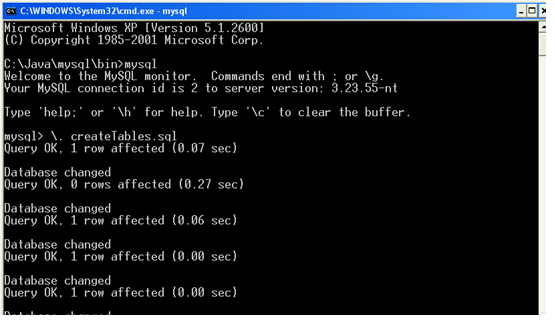

# Getting Started with JPA and Hibernate

## Aims
In this exercise, you will create a bean mapped to a MySQL database provided for you that contains some data about Compact Discs (remember them!). The basic Schema consists of a simple one to many relationship between a compact_discs table and a tracks table.

## Part 1 Create a Project

To being with, you will need to create a Maven project. How this is done depends upon your IDE. The following instructions are for Eclipse. Other IDEs will have a similar approach. If you are unsure, ask your instructor for assitance.

### IntelliJ

1. Click the `File` menu, and then click `New Project`.

2. At the `New Project` dialog, select `Maven` and then for the Project SDK, select a JDK 8. 
If no JDK 8 is available, select the option to download a JDK, and then select the JDK type of `AdoptOpenJDK`, and then select JDK 1.8.x.

3. Once the JDK is selected, click `Next`. 

4. At the `New Project` dialog, enter the project name of `BasicHibernate`.

5. Choose a suitable location for your project. It doesn't particularly matter where you put it.

6. Expand the `Artifact Coordinates` section and enter the following:

`Group ID`: com.conygre.training

`Artifact ID`: BasicHibernate

Leave the `Version` as it is.

7. Click `Finish`.


### Eclipse

1. In the Project Explorer, right click and then click New and then click Other.

2. At the New dialog, expand Maven and then select Maven Project. Click Next.

3. At the New Maven Project dialog, select Create a simple project, and click Next.
4. At the New Maven Project dialog, enter the following information:

`Group ID`: com.conygre.training

`Artifact ID`: Basichibernate

`Name`:	BasicHibernate

5.	Click `Finish`.

## Configure the Dependencies

Regardless of your IDE, now you can do the following:

1.	Open the pom.xml file in your editor (in Eclipse, you will need to click the Source tab).

2. 	Add the following dependencies to your project (you can paste them from this document). They go directly underneath the `name` element.

```
<dependencies>
	<dependency>
		<groupId>mysql</groupId>
		<artifactId>mysql-connector-java</artifactId>
		<version>8.0.22</version>
	</dependency>
	<dependency>
		<groupId>org.hibernate</groupId>
		<artifactId>hibernate-validator</artifactId>
		<version>4.3.0.Final</version>
	</dependency>
	<dependency>
		<groupId>org.hibernate</groupId>
		<artifactId>hibernate-entitymanager</artifactId>
		<version>4.1.4.Final</version>
	</dependency>
</dependencies>
```

3. Save the pom.xml. 

4. Update the project to download the dependencies. Your IDE will prompt you if you want to download the dependencies, select Yes to this request. In IntelliJ it is a small `M` button that appears in the top right of the pom.xml. In Eclipse, it appears as a prompt at the bottom right.


## Create the Database Tables

Note that you may not need to complete this step as depending upon network capability, we may have provided a database in the cloud or your VM in the cloud might have it set up already.

The following instructions involve the command prompt. You can also use MySQL Workbench if you prefer.

1.	MySQL should be installed and running on your machine. The script for creating the Compact Disc tables can be found in <LAB_HOME>labs\mysql \createTables.sql, so launch a command prompt in this folder.

2.	Type `mysql  –u root -p` and press enter.

3.	Enter the database password, which if you are using the course, will be `c0nygre`.

4.	To run the script, enter ‘\. createTables.sql’. See Figure 1.



5.	To confirm the tables have been created, in the console, type select * from compact_discs; to see the listing, and then select * from tracks; to see the second listing.

## Create a Mapped Entity Class

1.	Return to your Java IDE, and in the Project Explorer right click on the src/main/java folder and click New and then click Class. 

2.	Create the class with the name CompactDisc in the package com.conygre.training.entities.

3.	Add the following properties along with the get/set methods
(NOTE: Do not use Primitive types as they cannot be null and the table values might be null for some of these columns).


| Property | Type |
| -- | -- |
| id	| Integer |
| title| String |
| artist | String |
| price | Double |


4.	Add the annotation to specify that the class is an entity, and then the annotation specifying the table that you are mapping it to.

5.	Ensure that the class now implements the Serializable interface.

6.	Add annotations to each of the properties specifying which column in the database it maps to.

7.	Add the necessary annotations to enable the id column to be identified and to be auto-generated from the database.

## Creating the persistence.xml file
The persistence.xml file needs to be placed into the META-INF directory of src/main/resources. A partly completed file has been provided for you.

1.	Using Windows Explorer locate <LAB_HOME>\labs\hibernate\persistence.xml, and drag the file into your Eclipse project explorer src/main/resources/META-INF folder (you will need to create the META-INF folder).

2.	Set the name of the persistent unit to be conygrePersistentUnit.

3.	Set up the database connection details as specified in the comments in the file.


## Creating a Test Application

1.	In your src/main/java folder, create a new Java class called TestCompactDiscs.

2.	Within a main method, using the notes as a guide, write suitable code to retrieve a compact disc by its ID. Specifically, your code will need to:

    1.	Create an EntityManagerFactory

    2.	Create an EntityManager

    3.	Retrieve and start a transaction

    4.	Look up a CompactDisc

    5.	Commit the transaction and close EntityManager.


3.	Test your application.

When you run it, the output will be some warnings about Log4J and then (hopefully!) you’re working output. Log4J significantly makes debugging Hibernate applications a great deal easier, so you will now add a Log4J configuration file into the application.

4.	Using Windows Explorer, copy <LAB_HOME>\log4j\log4j.properties into your src\main\java folder and rerun the application. You will now see far more detailed output, and if your application didn’t work, you will have a much clearer idea of why when you read the logging messages.

5.	If you have time, experiment by adding your own new albums.

## Incorporating Relationships

### Aims
You will now create a class for the track table, and add in the annotations for the relationship between the compact disc and the track.
Create the Annotated Track Entity
1.	Return to Eclipse, and in the Project Explorer right click on the src/main/java folder and click New and then click Class. 

2.	Create the class with the name Track in the package com.conygre.training.entities.

3.	Add the following properties along with the get/set methods.

id	Integer

title	String

disc	CompactDisc


4.	Add the annotation to specify that the class is an entity, and then the annotation specifying the table that you are mapping it to.

5.	Ensure that the class now implements the Serializable interface.

6.	Add annotations to each of the properties specifying which column in the database it maps to.
For the disc property it needs to know which CompactDisc the track is on. 

```
@JoinColumn (name="cd_id", referencedColumnName="id", nullable = false)
@ManyToOne
private CompactDisc disc;
```

### Update the CompactDisc Entity

1.	Now open the CompactDisc class and add a new property of type List<Track> called trackTitles complete with get/set methods.

2.	Annotate the List as follows:

```
@OneToMany(mappedBy="disc")
private List<Track> trackTitles = new ArrayList<Track>();
```

3.	Add a new method to the CompactDisc class to allow users to add a track. In this method, you must also set the Track to know about the CompactDisc that it is on, so you can do this with:

```
public void addTrack(Track t) {
	t.setDisc(this);
	trackTitles.add(t);
}
```

4.	Open the TestCompactDiscs class and update the code to retrieve CD number 16 (which has tracks in the database), and then retrieve the track information and display it. A suitable query is shown below:

```
Query allSpiceGirlTracks = em.createQuery("select t.title from Track t where t.disc.id  = 16”);
```

5.	Run the application to see it working.


### Inserting a new Album

1.	Create a new CD object and set its properties. Add some Track objects the the CD.

2.	Persist the CD. Do the tracks go into the database? (you can check using the MySQL command line tool). If not, why not. 

3.	In the CompactDisc class, update the Annotation on the Track collection to cascade. Try adding an album again with tracks. Does it persist the tracks this time?

```
@OneToMany(mappedBy="disc", cascade={CascadeType.MERGE, CascadeType.PERSIST})
private List<Track> trackTitles = new ArrayList<Track>();
```

