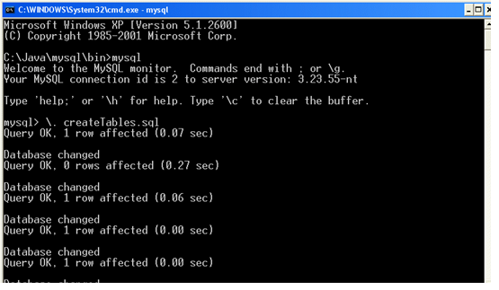

# Getting Started with JPA and Hibernate

## Aims
In this exercise, you will create a bean mapped to a MySQL database provided for you that contains some data about Compact Discs (remember them!). The basic Schema consists of a simple one to many relationship between a compact_discs table and a tracks table.

## Part 1 Create a Project

To being with, you will need to create a Maven project. How this is done depends upon your IDE. The following instructions are for Eclipse. Other IDEs will have a similar approach. If you are unsure, ask your instructor for assitance.

### IntelliJ

1. Click the `File` menu, and then click `New Project`.

2. At the `New Project` dialog, select `Maven` and then for the Project SDK, select a JDK 21. 
If no JDK is available, select the option to download a JDK, and then select the JDK type to be Microsoft OpenJDK21.

1. Once the JDK is selected, click `Next`. 

2. At the `New Project` dialog, enter the project name of `BasicHibernate`.

3. Choose a suitable location for your project. It doesn't particularly matter where you put it.

4. Expand the `Artifact Coordinates` section and enter the following:

`Group ID`: com.conygre.training

`Artifact ID`: BasicHibernate

Leave the `Version` as it is.

7. Click `Finish`.


## Configure the Dependencies


1.	Open the pom.xml file in your editor.

2. 	Add the following dependencies to your project (you can paste them from this document). They go directly underneath the `name` element. If you do not have a `name` element, then after the `version` element. Also, add in the Java version you plan to build with. Use a Java 21 version. 

```xml
<project xmlns="http://maven.apache.org/POM/4.0.0" 
	xmlns:xsi="http://www.w3.org/2001/XMLSchema-instance" xsi:schemaLocation="http://maven.apache.org/POM/4.0.0 http://maven.apache.org/xsd/maven-4.0.0.xsd">
	<modelVersion>4.0.0</modelVersion>
	<groupId>com.conygre.training</groupId>
	<artifactId>basichibernate</artifactId>
	<version>0.0.1-SNAPSHOT</version>
	<name>BasicHibernate</name>

	<dependencies>
		<dependency>
			<groupId>org.apache.logging.log4j</groupId>
			<artifactId>log4j-core</artifactId>
			<version>2.20.0</version>
		</dependency>
		<dependency>
			<groupId>org.apache.logging.log4j</groupId>
			<artifactId>log4j-api</artifactId>
			<version>2.20.0</version>
		</dependency>
		<dependency>
			<groupId>mysql</groupId>
			<artifactId>mysql-connector-java</artifactId>
			<version>8.0.22</version>
		</dependency>
		<dependency>
			<groupId>org.hibernate</groupId>
			<artifactId>hibernate-core</artifactId>
			<version>6.3.0.Final</version>
		</dependency>
	</dependencies>
	<build>
		<pluginManagement>
			<plugins>
				<plugin>
					<groupId>org.apache.maven.plugins</groupId>
					<artifactId>maven-compiler-plugin</artifactId>
					<version>3.10.1</version>
					<configuration>
						<source>21</source>
						<target>21</target>
					</configuration>
				</plugin>

			</plugins>
		</pluginManagement>

	</build>
</project>

```

Also, in the pom.xml file, add the Java version you plan to use. So for example:


3. Save the pom.xml. 

4. Update the project to download the dependencies. Your IDE will prompt you if you want to download the dependencies, select Yes to this request. In IntelliJ it is a small `M` button that appears in the top right of the pom.xml. 


## Create the Database Tables


The following instructions use MySQL Workbench 8. You can also use the command line if you prefer.

1.	MySQL should be installed and running on your machine. Launch MySQL Workbench 8.

2.	Connect to your MySQL server by clicking on the connection (typically named "Local instance MySQL"). If prompted, enter the database password, which if you are using the course, will be the same as that for your virtual machine.

3.	Once connected, open the SQL script by clicking `File` > `Open SQL Script` from the menu, and navigate to `<LAB_HOME>labs\mysql\createTables.sql`.

4.	To run the script, click the lightning bolt icon (Execute) in the toolbar, or press `Ctrl+Shift+Enter` to execute the entire script.



5.	To confirm the tables have been created, in a new query tab, type ```SELECT * FROM compact_discs;``` and click the lightning bolt icon to see the listing. Then type ```SELECT * FROM tracks;``` and execute to see the second listing.

## Create a Mapped Entity Class

1.	Return to your Java IDE, and in the Project Explorer right click on the src/main/java folder and click New and then click Class. 

2.	Create the class with the name CompactDisc in the package com.conygre.training.entities.

3.	Add the following properties along with the get/set methods
(NOTE: Do not use Primitive types as they cannot be null and the table values might be null for some of these columns).


| Property | Type |
| -- | -- |
| id	| Integer |
| title| String |
| artist | String |
| price | Double |


4.	Add the annotation (jakarta.persistence.Entity) to specify that the class is an entity, and then the annotation specifying the table that you are mapping it to.

5.	Ensure that the class now implements the Serializable interface.

6.	Add annotations to each of the properties specifying which column in the database it maps to.

7.	Add the necessary annotations to enable the id column to be identified and to be auto-generated from the database.

## Creating the persistence.xml file
The persistence.xml file needs to be placed into the META-INF directory of src/main/resources. A partly completed file has been provided for you.

1.	Using Windows Explorer locate <LAB_HOME>\labs\hibernate\persistence.xml, and drag the file into your Eclipse project explorer src/main/resources/META-INF folder (you will need to create the META-INF folder).

2.	Set the name of the persistent unit to be conygrePersistentUnit.

3. The file has already been set up to successfully connect to your database. Just check the password as it may be different!


## Creating a Test Application

1.	In your src/main/java folder, create a new Java class called TestCompactDiscs.

2.	Within a main method, using the notes as a guide, write suitable code to retrieve a compact disc by its ID. Specifically, your code will need to:

    1.	Create an EntityManagerFactory

    2.	Create an EntityManager

    3.	Retrieve and start a transaction

    4.	Look up a CompactDisc

    5.	Commit the transaction and close EntityManager.


3.	Test your application by running the code. You should see some output from the database.


4.	Using Windows Explorer, copy <LAB_HOME>\log4j\log4j2.xml into your src\main\resources folder and rerun the application. You will now see far more detailed output, and if your application didn’t work, you will have a much clearer idea of why when you read the logging messages.

5.	If you have time, experiment by adding your own new albums.

